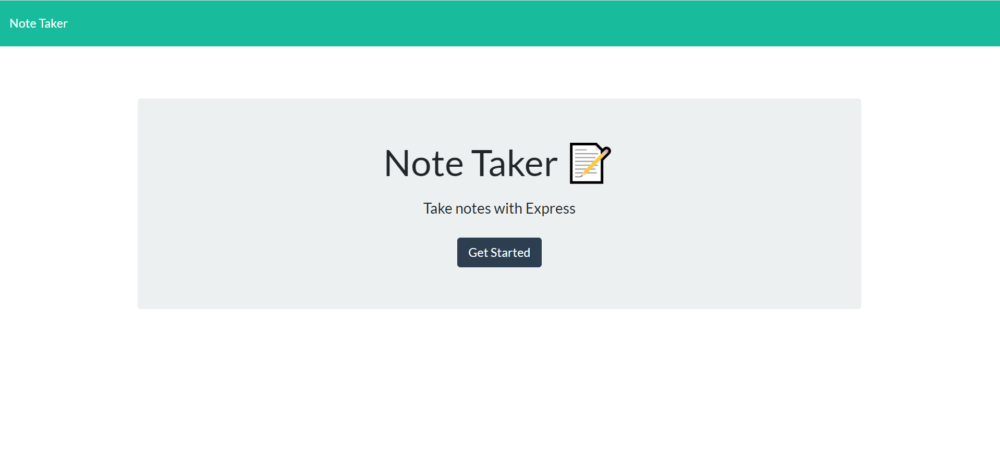
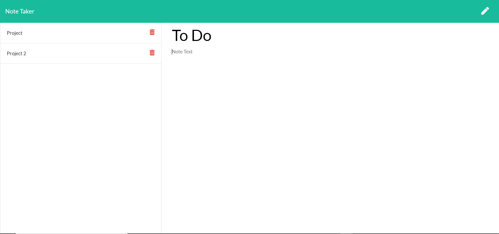

# Note_Taker
## Description

This is an application that allows the user to create, save, and delete notes. This project uses Express.JS to create and pass a local API set within a JSON file. I was responsible for developing API and HTML Routes so that the user can dynamically add and save, or delete content within the JSON file, and then in response, the application will display the content on the page. I also had to dynamically generate unique ID's for reach note created so that the save and delete functions could function appropriately.

## Table of Contents

* [License](#license)
* [Contributing](#contributing)
* [Screenshots](#screenshots)
* [Link](#link)
* [Questions](#questions)

## License

MIT

## Contributing

Ianaac27

# Screenshots
Here are mocks of the Note Taker.

# Link
Take a look at the live version through Heroku [here.](https://note-taker-ifc.herokuapp.com/)

## Questions

If you have any questions, please refer to my contact information below.

[GitHub: Ianaac27](https://www.github.com/Ianaac27)

Email: ian.fleshmancooper@gmail.com
